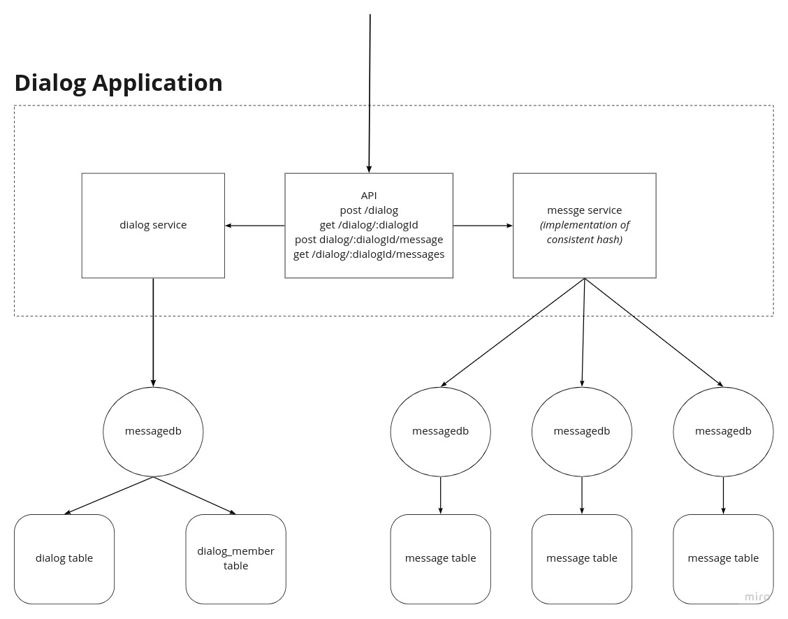

# Отчет о выполнении домашнего задания "Масштабируемая подсистема диалогов"

## Архитектура
Диалоги и их участники хранятся в отдельной базе данных ```dialogdb```, шардирование не используется, т.к. основная нагрузка будет вызвана сообщениями  

Сообщения хранятся в маштабируемых базах данных ```messagedb```, которые шардируются по ключу ```dialogId```.  

```dialogId``` выбран в качестве ключа, т.к. основная нагрузка в запросах на чтение - это получение списка сообщений по ```dialogId```, отсортированных по дате. Разносить по шардам сообщения бессмыслено, т.к. придется делать join(ы) между разными шардами, чтобы собрать список сообщений.  

Логика шардирования реализована в приложении с использованием подхода консистентного хэширования, что позволяет при необходимости добавлять практически неограниченное количество шард.



## Шардирование
Начальное количество шард равномерно распределяется на условном круге. 
Круг делится на максимальное значение uint32. Например, если у нас две шарды, то у 1-й ```hashId = 0```, а у 2-й ```hashId = 2 147 483 647```,
если у нас три шарды, то у 1-й ```hashId = 0```, у 2-й ```hashId = 1 431 655 765```, у 3-й ```hashId = 2 863 311 530```.  

Для определения шарды для записи сообщений диалога вычесляется контрольная сумма от ```dialogId``` по алгоритму crc32, затем выполняется поиск ближайшей шарды на круге.

Если на одну из шард пишется больше, чем на другие, то выполняется решардирования. 
На круге перед шардой с выской нагрузкой добавляется еще одна шарда, так, чтобы часть нагрузки распределить между нагруженной шардой и новой шардой. 
Например у нас две шарды, 1-я ```hashId = 0```, 2-я ```hashId = 2 147 483 647```, шаг между шардами ```2 147 483 647```. 
Добавляем шарду посередине и получаем 1-я ```hashId = 0```, новая шарда ```hashId = 1 073 741 823```, 2-я ```hashId = 2 147 483 647```. 
Таким образом сообщения диалогов, которые раньше писались на 1-ю шарду будут распределяться между 1-й шардой и новой шардой. Нагрузка на 2-ю шарду останется без изменений. 

## Решение проблемы с эффектом Леди Гаги
Выбор ключа шардирования был обсусловлен спецификой реализации диалогов и потребностью постоянно читать из БД списки сообщений конкретного диалога, отсортированные по дате. 
Если один из пользователей пишет гораздо больше остальных, то это создаст нагрузку на конкретную шарду (шарды), где размещаются сообщения диалогов, в которые пишет данный пользователь.
Использование консистетного хэширования позволяет при необходимости гибко добавить шарды и равномерно распределить нагрузку между ними.

## Решардирование без downtime
Представим, что на одной из БД (highLoadDb) у нас повышенная нагрузка и требуется выполнить решардирование.  
1. Добавляем две новых БД, 1-я новая БД (newShard) на круге, 2-я клон highLoadDb (cloneHighLoadDb) с тем же hashId на круге.
2. Начинаем писать сообщения в соответствии с новым распределением на круге в newShard и cloneHighLoadDb.
3. highLoadDb используется только для чтения.
4. Для корретного чтения, сначала читаем записи из новых БД и при необходимости обращаемся highLoadDb.
5. Запускаем отдельный процесс, который вычитывает данные с highLoadDb и распределяет их между newShard и cloneHighLoadDb.
6. После того, как данные полность распределены между новыми БД, проверяем корректность переноса.
7. Выключаем highLoadDb.

